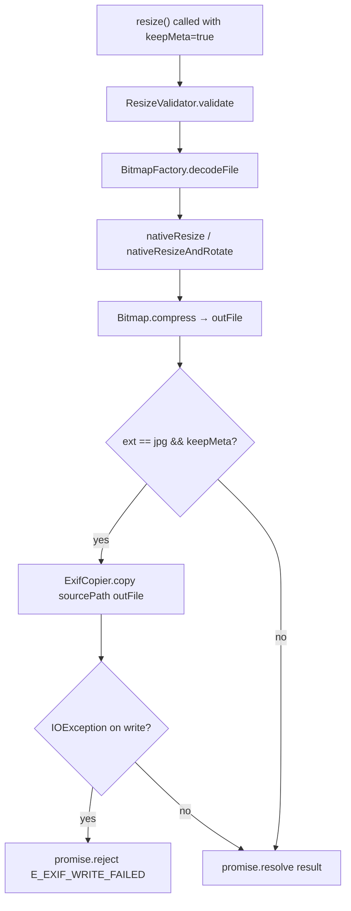

# keepMeta / EXIF Copy — Design

**Spec**: `.specs/features/keep-meta-exif/spec.md`
**Status**: Draft

---

## Architecture Overview

EXIF copy is a pure post-process step inserted **after** `Bitmap.compress` writes the output file to disk — `ExifInterface` requires an on-disk file, not a stream. The rest of the resize pipeline is unchanged.



**Read failure inside `ExifCopier.copy`** → silent return (corrupt/missing EXIF is common; resize still useful).  
**Write failure inside `ExifCopier.copy`** → `IOException` propagates to caller → `promise.reject("E_EXIF_WRITE_FAILED", ...)`.

---

## Code Reuse Analysis

### Existing Components to Leverage

| Component | Location | How to Use |
|---|---|---|
| `ResizeParams` data class | `ResizeValidator.kt` | Add `keepMeta: Boolean = false` field |
| `ResizeValidator.validate` | `ResizeValidator.kt` | No change needed — `keepMeta` has no validation rules |
| `LibyuvResizerModule.resize` | `LibyuvResizerModule.kt` | Insert `ExifCopier.copy` call between compress and resolve |
| `resolveOutputFile` | `LibyuvResizerModule.kt` | Already returns `File` with correct ext — reuse `ext` local var |
| Existing instrumented test fixtures | `TestFixtures.kt` | Add JPEG-with-EXIF test asset alongside existing test images |

### Integration Points

| System | Integration Method |
|---|---|
| TurboModule codegen | Add `keepMeta: boolean` to `NativeLibyuvResizer.ts` → regenerate → Kotlin spec gains param |
| Android build deps | `androidx.exifinterface:exifinterface` added to `android/build.gradle` |
| iOS stub `.mm` | Accept `keepMeta:(BOOL)keepMeta` — ignore; no logic change |

---

## Components

### ExifCopier (new)

- **Purpose**: Copy all EXIF tags from source JPEG to output JPEG; reset orientation to normal
- **Location**: `android/src/main/java/com/libyuvresizer/ExifCopier.kt`
- **Interfaces**:
  - `fun copy(sourcePath: String, destPath: String)` — reads source EXIF, writes to dest, calls `saveAttributes()`. Read failure is silent (returns early). Write failure throws `IOException`.
- **Dependencies**: `androidx.exifinterface:exifinterface`
- **Reuses**: Nothing — new pure-Kotlin object; no Android runtime dependency beyond file I/O

```kotlin
internal object ExifCopier {
    fun copy(sourcePath: String, destPath: String) {
        val src = try { ExifInterface(sourcePath) } catch (_: IOException) { return }
        val dst = ExifInterface(destPath)           // IOException propagates → caller rejects
        for (tag in TAGS) {
            src.getAttribute(tag)?.let { dst.setAttribute(tag, it) }
        }
        dst.setAttribute(ExifInterface.TAG_ORIENTATION, ExifInterface.ORIENTATION_NORMAL.toString())
        dst.saveAttributes()
    }

    // Explicit list — no reflection. All TAG_* constants from ExifInterface 1.3.x.
    private val TAGS = listOf(
        ExifInterface.TAG_APERTURE_VALUE,
        ExifInterface.TAG_ARTIST,
        ExifInterface.TAG_BITS_PER_SAMPLE,
        ExifInterface.TAG_BRIGHTNESS_VALUE,
        ExifInterface.TAG_CAMERA_OWNER_NAME,
        ExifInterface.TAG_CFA_PATTERN,
        ExifInterface.TAG_COLOR_SPACE,
        ExifInterface.TAG_COMPONENTS_CONFIGURATION,
        ExifInterface.TAG_COMPRESSED_BITS_PER_PIXEL,
        ExifInterface.TAG_COMPRESSION,
        ExifInterface.TAG_CONTRAST,
        ExifInterface.TAG_COPYRIGHT,
        ExifInterface.TAG_CUSTOM_RENDERED,
        ExifInterface.TAG_DATETIME,
        ExifInterface.TAG_DATETIME_DIGITIZED,
        ExifInterface.TAG_DATETIME_ORIGINAL,
        ExifInterface.TAG_DEFAULT_CROP_SIZE,
        ExifInterface.TAG_DEVICE_SETTING_DESCRIPTION,
        ExifInterface.TAG_DIGITAL_ZOOM_RATIO,
        ExifInterface.TAG_DNG_VERSION,
        ExifInterface.TAG_EXIF_VERSION,
        ExifInterface.TAG_EXPOSURE_BIAS_VALUE,
        ExifInterface.TAG_EXPOSURE_INDEX,
        ExifInterface.TAG_EXPOSURE_MODE,
        ExifInterface.TAG_EXPOSURE_PROGRAM,
        ExifInterface.TAG_EXPOSURE_TIME,
        ExifInterface.TAG_F_NUMBER,
        ExifInterface.TAG_FILE_SOURCE,
        ExifInterface.TAG_FLASH,
        ExifInterface.TAG_FLASH_ENERGY,
        ExifInterface.TAG_FLASHPIX_VERSION,
        ExifInterface.TAG_FOCAL_LENGTH,
        ExifInterface.TAG_FOCAL_LENGTH_IN_35MM_FILM,
        ExifInterface.TAG_FOCAL_PLANE_RESOLUTION_UNIT,
        ExifInterface.TAG_FOCAL_PLANE_X_RESOLUTION,
        ExifInterface.TAG_FOCAL_PLANE_Y_RESOLUTION,
        ExifInterface.TAG_GAIN_CONTROL,
        ExifInterface.TAG_GPS_ALTITUDE,
        ExifInterface.TAG_GPS_ALTITUDE_REF,
        ExifInterface.TAG_GPS_AREA_INFORMATION,
        ExifInterface.TAG_GPS_DATESTAMP,
        ExifInterface.TAG_GPS_DEST_BEARING,
        ExifInterface.TAG_GPS_DEST_BEARING_REF,
        ExifInterface.TAG_GPS_DEST_DISTANCE,
        ExifInterface.TAG_GPS_DEST_DISTANCE_REF,
        ExifInterface.TAG_GPS_DEST_LATITUDE,
        ExifInterface.TAG_GPS_DEST_LATITUDE_REF,
        ExifInterface.TAG_GPS_DEST_LONGITUDE,
        ExifInterface.TAG_GPS_DEST_LONGITUDE_REF,
        ExifInterface.TAG_GPS_DIFFERENTIAL,
        ExifInterface.TAG_GPS_DOP,
        ExifInterface.TAG_GPS_H_POSITIONING_ERROR,
        ExifInterface.TAG_GPS_IMG_DIRECTION,
        ExifInterface.TAG_GPS_IMG_DIRECTION_REF,
        ExifInterface.TAG_GPS_LATITUDE,
        ExifInterface.TAG_GPS_LATITUDE_REF,
        ExifInterface.TAG_GPS_LONGITUDE,
        ExifInterface.TAG_GPS_LONGITUDE_REF,
        ExifInterface.TAG_GPS_MAP_DATUM,
        ExifInterface.TAG_GPS_MEASURE_MODE,
        ExifInterface.TAG_GPS_PROCESSING_METHOD,
        ExifInterface.TAG_GPS_SATELLITES,
        ExifInterface.TAG_GPS_SPEED,
        ExifInterface.TAG_GPS_SPEED_REF,
        ExifInterface.TAG_GPS_STATUS,
        ExifInterface.TAG_GPS_TIMESTAMP,
        ExifInterface.TAG_GPS_TRACK,
        ExifInterface.TAG_GPS_TRACK_REF,
        ExifInterface.TAG_GPS_VERSION_ID,
        ExifInterface.TAG_IMAGE_DESCRIPTION,
        ExifInterface.TAG_IMAGE_LENGTH,
        ExifInterface.TAG_IMAGE_UNIQUE_ID,
        ExifInterface.TAG_IMAGE_WIDTH,
        ExifInterface.TAG_INTEROPERABILITY_INDEX,
        ExifInterface.TAG_ISO_SPEED,
        ExifInterface.TAG_ISO_SPEED_LATITUDE_YYY,
        ExifInterface.TAG_ISO_SPEED_LATITUDE_ZZZ,
        ExifInterface.TAG_ISO_SPEED_RATINGS,
        ExifInterface.TAG_JPEG_INTERCHANGE_FORMAT,
        ExifInterface.TAG_JPEG_INTERCHANGE_FORMAT_LENGTH,
        ExifInterface.TAG_LENS_MAKE,
        ExifInterface.TAG_LENS_MODEL,
        ExifInterface.TAG_LENS_SERIAL_NUMBER,
        ExifInterface.TAG_LENS_SPECIFICATION,
        ExifInterface.TAG_LIGHT_SOURCE,
        ExifInterface.TAG_MAKE,
        ExifInterface.TAG_MAKER_NOTE,
        ExifInterface.TAG_MAX_APERTURE_VALUE,
        ExifInterface.TAG_METERING_MODE,
        ExifInterface.TAG_MODEL,
        ExifInterface.TAG_NEW_SUBFILE_TYPE,
        ExifInterface.TAG_OECF,
        ExifInterface.TAG_ORF_ASPECT_FRAME,
        ExifInterface.TAG_ORF_PREVIEW_IMAGE_LENGTH,
        ExifInterface.TAG_ORF_PREVIEW_IMAGE_START,
        ExifInterface.TAG_ORF_THUMBNAIL_IMAGE,
        ExifInterface.TAG_PHOTOMETRIC_INTERPRETATION,
        ExifInterface.TAG_PIXEL_X_DIMENSION,
        ExifInterface.TAG_PIXEL_Y_DIMENSION,
        ExifInterface.TAG_PLANAR_CONFIGURATION,
        ExifInterface.TAG_PRIMARY_CHROMATICITIES,
        ExifInterface.TAG_REFERENCE_BLACK_WHITE,
        ExifInterface.TAG_RELATED_SOUND_FILE,
        ExifInterface.TAG_RESOLUTION_UNIT,
        ExifInterface.TAG_ROWS_PER_STRIP,
        ExifInterface.TAG_RW2_ISO,
        ExifInterface.TAG_RW2_JPG_FROM_RAW,
        ExifInterface.TAG_RW2_SENSOR_BOTTOM_BORDER,
        ExifInterface.TAG_RW2_SENSOR_LEFT_BORDER,
        ExifInterface.TAG_RW2_SENSOR_RIGHT_BORDER,
        ExifInterface.TAG_RW2_SENSOR_TOP_BORDER,
        ExifInterface.TAG_SAMPLES_PER_PIXEL,
        ExifInterface.TAG_SATURATION,
        ExifInterface.TAG_SCENE_CAPTURE_TYPE,
        ExifInterface.TAG_SCENE_TYPE,
        ExifInterface.TAG_SENSING_METHOD,
        ExifInterface.TAG_SHARPNESS,
        ExifInterface.TAG_SHUTTER_SPEED_VALUE,
        ExifInterface.TAG_SOFTWARE,
        ExifInterface.TAG_SPATIAL_FREQUENCY_RESPONSE,
        ExifInterface.TAG_SPECTRAL_SENSITIVITY,
        ExifInterface.TAG_STRIP_BYTE_COUNTS,
        ExifInterface.TAG_STRIP_OFFSETS,
        ExifInterface.TAG_SUBFILE_TYPE,
        ExifInterface.TAG_SUBJECT_AREA,
        ExifInterface.TAG_SUBJECT_DISTANCE,
        ExifInterface.TAG_SUBJECT_DISTANCE_RANGE,
        ExifInterface.TAG_SUBJECT_LOCATION,
        ExifInterface.TAG_SUBSEC_TIME,
        ExifInterface.TAG_SUBSEC_TIME_DIGITIZED,
        ExifInterface.TAG_SUBSEC_TIME_ORIGINAL,
        ExifInterface.TAG_THUMBNAIL_IMAGE_LENGTH,
        ExifInterface.TAG_THUMBNAIL_IMAGE_WIDTH,
        ExifInterface.TAG_TRANSFER_FUNCTION,
        ExifInterface.TAG_USER_COMMENT,
        ExifInterface.TAG_WHITE_BALANCE,
        ExifInterface.TAG_WHITE_POINT,
        ExifInterface.TAG_X_RESOLUTION,
        ExifInterface.TAG_Y_CB_CR_COEFFICIENTS,
        ExifInterface.TAG_Y_CB_CR_POSITIONING,
        ExifInterface.TAG_Y_CB_CR_SUB_SAMPLING,
        ExifInterface.TAG_Y_RESOLUTION,
        // TAG_ORIENTATION intentionally excluded — reset to NORMAL after copy
    )
}
```

---

### ResizeParams (modified)

- **Purpose**: Carry all validated resize parameters including `keepMeta`
- **Location**: `android/src/main/java/com/libyuvresizer/ResizeValidator.kt` (same file, existing data class)
- **Change**: Add `val keepMeta: Boolean = false` field at end — backward compatible with existing `ResizeParams(...)` call sites via default

---

### LibyuvResizerModule (modified)

- **Purpose**: Native bridge; now passes `keepMeta` from bridge call → `ExifCopier` post-compress
- **Location**: `android/src/main/java/com/libyuvresizer/LibyuvResizerModule.kt`
- **Change**: Add `keepMeta: Boolean` parameter to `override fun resize(...)`, include in `ResizeParams`, call `ExifCopier.copy` conditionally after compress

Insertion point in existing code:
```kotlin
// After: FileOutputStream(outFile).use { fos -> dstBitmap.compress(fmt, q, fos) }
// Before: val result = Arguments.createMap()...

if (params.keepMeta && ext == "jpg") {
    try {
        ExifCopier.copy(filePath, outFile.absolutePath)
    } catch (e: IOException) {
        promise.reject("E_EXIF_WRITE_FAILED", e.message ?: "Failed to write EXIF metadata")
        return
    }
}
```

---

### NativeLibyuvResizer.ts (modified)

- **Purpose**: Turbo Module codegen spec — source of truth for the native bridge interface
- **Location**: `src/NativeLibyuvResizer.ts`
- **Change**: Add `keepMeta: boolean` as 9th positional parameter to `resize()`

```typescript
resize(
  filePath: string,
  targetWidth: number,
  targetHeight: number,
  quality: number,
  rotation: number,
  mode: string,
  outputPath: string,
  filterMode: string,
  keepMeta: boolean    // ← new
): Promise<ResizeResult>;
```

---

### resizer.native.tsx (modified)

- **Purpose**: Public JS API — validates options and forwards to native spec
- **Location**: `src/resizer.native.tsx`
- **Changes**:
  - Add `keepMeta?: boolean` to `ResizeOptions` interface
  - Pass `options?.keepMeta ?? false` as 9th arg to `LibyuvResizer.resize(...)`

---

### resizer.tsx — web fallback (modified)

- **Purpose**: Web/non-native fallback — always rejects
- **Location**: `src/resizer.tsx`
- **Change**: Add `keepMeta?` to `ResizeOptions` re-export — no logic change (already rejects)

---

### ios/LibyuvResizer.mm (modified)

- **Purpose**: iOS stub — accept `keepMeta` param, ignore
- **Location**: `ios/LibyuvResizer.mm`
- **Change**: Add `keepMeta:(BOOL)keepMeta` parameter to `RCT_EXPORT_METHOD`; behavior unchanged (`E_NOT_IMPLEMENTED`)

---

## Data Models

### ResizeOptions (TypeScript — modified)

```typescript
export interface ResizeOptions {
  rotation?: RotationAngle;
  mode?: ResizeMode;
  filterMode?: FilterMode;
  outputPath?: string;
  keepMeta?: boolean;   // ← new; default false; Android-only; no-op on iOS and PNG output
}
```

---

## Error Handling Strategy

| Error Scenario | Handling | User Impact |
|---|---|---|
| Source EXIF unreadable (corrupt/missing) | `ExifInterface(sourcePath)` throws → caught inside `ExifCopier.copy` → silent return | No error; EXIF simply not copied |
| Output EXIF write fails (disk full, permissions) | `IOException` propagates from `ExifCopier.copy` → `promise.reject("E_EXIF_WRITE_FAILED", msg)` | Promise rejects with `E_EXIF_WRITE_FAILED` |
| `keepMeta: true` + PNG output (`ext == "png"`) | Condition `ext == "jpg"` is false → `ExifCopier.copy` not called | Promise resolves normally; no EXIF |
| `keepMeta: true` on iOS | No code path exists on iOS stub — param accepted, ignored | Promise rejects with existing `E_NOT_IMPLEMENTED` |
| `keepMeta` absent / `false` | Branch not entered | Zero overhead; identical to current behavior |

---

## Tech Decisions

| Decision | Choice | Rationale |
|---|---|---|
| Explicit `TAG_*` list vs reflection | Explicit list | Reflection on `ExifInterface` fields is brittle across library versions; explicit list is predictable and greppable |
| `ExifCopier` as `internal object` | `internal object` | Stateless utility; `internal` keeps it out of public API; matches `ResizeValidator` pattern |
| `ExifCopier` in separate file | `ExifCopier.kt` | File-per-class rule; keeps `ResizeValidator.kt` under 800 lines |
| Read failure silent vs error | Silent | Corrupt EXIF is common on social-media-sourced images; resize is still useful |
| Write failure error vs silent | Error | Caller opted into `keepMeta`; silent failure would be deceptive |
| `TAG_ORIENTATION` reset after copy | Always reset to `ORIENTATION_NORMAL` | Bitmap was decoded respecting original orientation; output image is geometrically correct; keeping source orientation would cause double-rotation on display |
| `keepMeta` position in spec | Last positional arg (#9) | TurboModule bridge uses positional args; appending is non-breaking for callers who pass options by name |
| `androidx.exifinterface` version | Match version already in RN host app or latest stable | Avoid dep conflict; RN apps typically already have it transitively |
